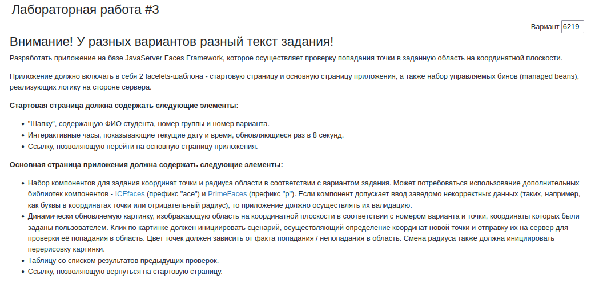
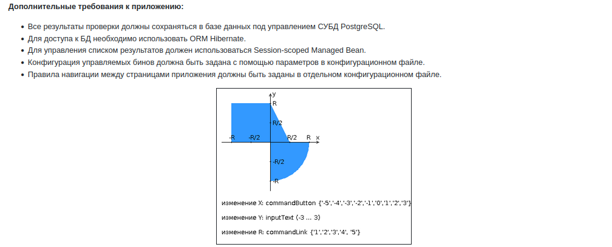

# Третья лаботаторная по WEB-программированию

Неевин Кирилл P3213, вариант #6219

## Задание




Прокинуть порт:

```shell
ssh -L 8098:localhost:8098 s313087@helios.se.ifmo.ru -p 2222
```

Сайт доступен по адресу: `http://localhost:8098/lab2_war/`
